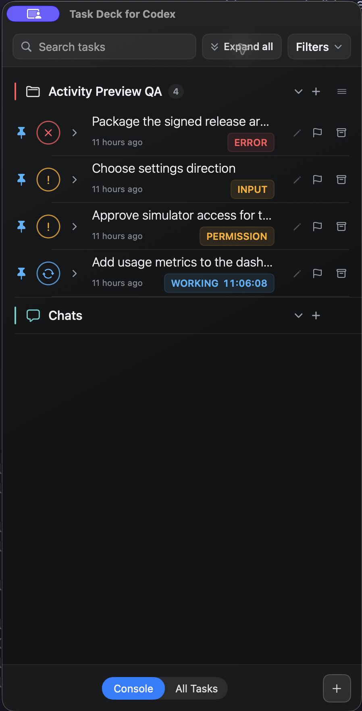
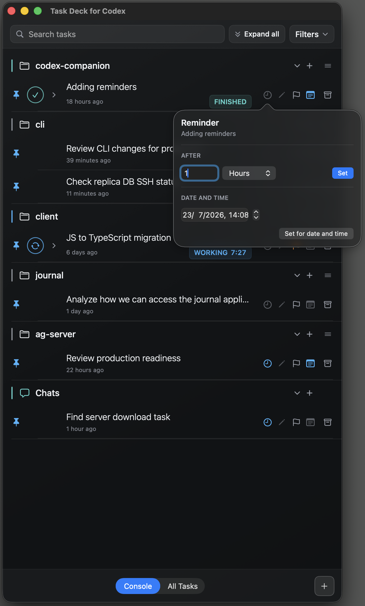
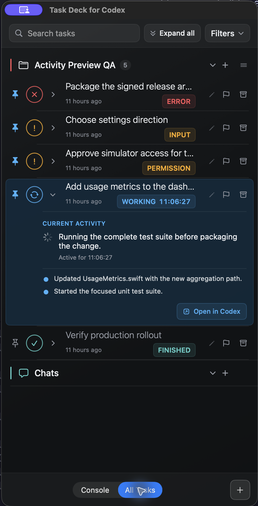

# Task Deck for Codex

**Your control room for Codex tasks.**

Task Deck for Codex is a native macOS companion that helps you orchestrate many Codex tasks without losing focus. It brings every task into one clear view, shows what each task is doing in real time, and helps you decide what deserves your attention now.

Pin the work that matters, highlight priorities, capture observations, and add reminders for anything you need to revisit. You stay focused on the current task while Task Deck keeps the rest of your Codex work visible and easy to recover.

## Download

**[Download Task Deck for Codex (.dmg) →](https://github.com/awronski/task-deck-for-codex/releases/latest/download/TaskDeckForCodex.dmg)**

The ready-made app is Developer ID signed and Apple notarized. Open the DMG and drag Task Deck for Codex to Applications—no source build is required. Task Deck has no network client of its own, so your task data and personal notes stay on your Mac. Optional title syncing asks Codex's bundled local app server to update Codex's own task name.

## See your Codex work at a glance

<p align="center">
  <a href="docs/images/task-deck-attention-states.png">
    
  </a>
</p>

<p align="center">
  <sub><strong>Monitor every task</strong> from one clear view and keep the work that matters in focus.</sub>
</p>

<details>
<summary><strong>See reminders and expanded live activity</strong></summary>
<br>
<p align="center">
  <a href="docs/images/task-deck-attention-states-reminder.png">
    
  </a>
  &nbsp;
  <a href="docs/images/task-deck-attention-states-expanded.png">
    
  </a>
</p>
<p align="center">
  <sub><strong>Set reminders</strong> for work to revisit · <strong>Expand activity</strong> to see what Codex is doing now</sub>
</p>
</details>

## Stay in control of every task

### See what Codex is doing in real time

Working, waiting, finished, and failed tasks are visible together. Expand any task to read its current activity and recent updates, then jump directly into Codex only when you need to intervene.

### Keep the most important work in focus

Pin important tasks to your Console, mark work in progress with a blue flag, use yellow, orange, or red flags for issues, and mark production-ready work with a green flag. Your highest-value task stays easy to find even while many other tasks continue in parallel.

### Preserve the context you do not want to lose

Add a private note when you discover a constraint, finish part of the work, or need to wait for external information. Your observations remain attached to the task, ready when you return days later.

### Bring work back at the right time

Set a reminder after a delay or for an exact date and time. Snooze when necessary, recover reminders missed while the app or Mac was off, and bring the associated task back into your Console when it needs attention.

### Manage many tasks without endless scrolling

Group tasks by project, search instantly, filter by task type or status, and collapse or expand activity in bulk. The Console keeps your chosen tasks close while All Tasks provides the complete picture.

### Move from overview to action

Open any task directly in Codex, start a new task inside the right project, rename tasks for clarity, optionally sync those titles back to Codex, or archive completed work with undo. Task Deck removes the navigation overhead between noticing something and acting on it.

## More useful controls

- Persistent project ordering and a dedicated Chats group
- Relative creation times and elapsed working time
- Local task-title overrides, flags, notes, reminders, and pins
- Configurable font family and size
- Automatic refresh from Codex's local task data

## Requirements

- macOS 26 or later
- Codex for macOS

## Privacy and local data

Task Deck for Codex has no network client of its own. It accesses Codex only through local files, Codex's bundled command-line and app-server tools, and local desktop IPC.

Codex state is read locally from:

- `~/.codex/state_5.sqlite`
- `~/.codex/.codex-global-state.json`
- Session JSONL files under `~/.codex/sessions/`

Archiving and undo use Codex's bundled command-line tool so Codex moves session files and updates its state consistently. When Codex's local app-server control socket is reachable, Task Deck connects to that shared server so tasks already open in Codex can be archived without competing for their writer lock. Pins, title overrides, flags, notes, reminders, project order, and other Task Deck preferences are stored locally in macOS `UserDefaults`.

## Compatibility and unofficial status

> [!WARNING]
> Task Deck for Codex is not affiliated with, endorsed by, or supported by OpenAI. It relies on undocumented Codex database, session, and local desktop IPC formats that may change without notice.

A Codex update may temporarily affect task discovery, status reporting, or immediate sidebar refresh. Keeping this integration local limits its reach: Task Deck does not send your data to an external service.

## Build from source (optional)

Most users should install the signed and notarized DMG. Building from source is useful only if you want to inspect or develop the project. It requires Xcode 26 with Swift 6.2.

```sh
git clone https://github.com/awronski/task-deck-for-codex.git
cd task-deck-for-codex
./script/build_and_run.sh
```

The helper creates an ad-hoc-signed local app and launches it. Run the tests with:

```sh
DEVELOPER_DIR=/Applications/Xcode.app/Contents/Developer swift test
```

<details>
<summary>Maintainer release packaging</summary>

Create a local DMG:

```sh
./script/package_dmg.sh
```

Create a Developer ID-signed and notarized DMG:

```sh
SIGNING_IDENTITY="Developer ID Application: Your Name (TEAMID)" \
NOTARIZE=1 \
NOTARY_PROFILE="your-notary-profile" \
./script/package_dmg.sh
```

The script writes `dist/TaskDeckForCodex.dmg`. With `NOTARIZE=1`, it signs, submits, staples, and verifies both the app and DMG. Generated app and DMG artifacts are ignored by Git; the default ad-hoc signature is for local testing only.

</details>

## License

[MIT](LICENSE)
