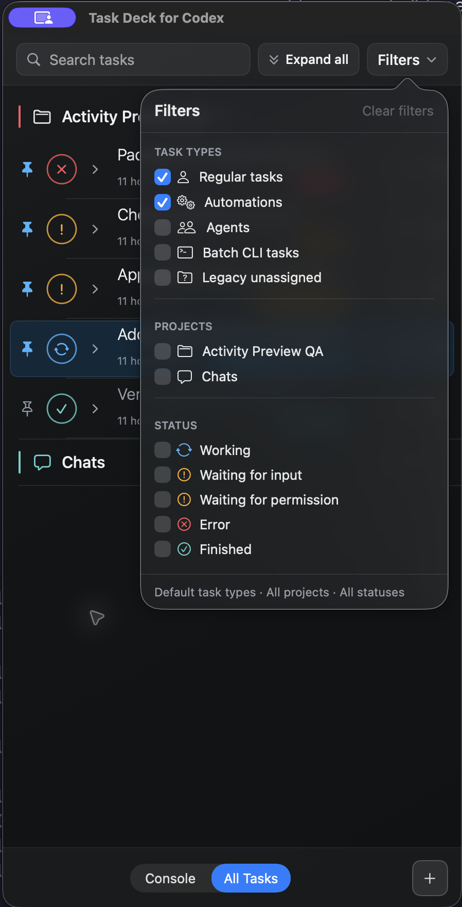

# Task Deck for Codex

Task Deck for Codex is an unofficial native macOS companion for keeping active Codex tasks visible without navigating the full Codex sidebar. It groups tasks by project, highlights work that needs attention, and opens tasks directly in Codex.

## Download

**[Download Task Deck for Codex (.dmg) →](https://github.com/awronski/task-deck-for-codex/releases/latest/download/TaskDeckForCodex.dmg)**

The ready-made build is Developer ID signed and Apple notarized. Open the DMG and drag Task Deck for Codex to Applications—building from source is optional.

<p align="center">
  <a href="docs/images/task-deck-attention-states-expanded.png">
    
  </a>
</p>

<details>
<summary><strong>More screenshots</strong> — task states and filters</summary>
<br>
<p align="center">
  <a href="docs/images/task-deck-attention-states.png">
    
  </a>
  <a href="docs/images/task-deck-attention-states-filters.png">
    
  </a>
</p>
</details>

## Features

- Console and All Tasks views with search and multi-select filters
- Project grouping, persistent project ordering, and a dedicated Chats group
- Persistent task pins and local title overrides
- Persistent no-flag, yellow, orange, and red task flags
- Persistent private notes for pausing and resuming task context
- Task archiving with undo
- Live working, input, permission, finished, and error states
- Expandable inline activity previews with independent and bulk controls
- Elapsed working time and relative creation time
- Configurable font family and font size
- New-task shortcuts and direct navigation to tasks in Codex
- Automatic refresh from Codex's local task data

## Requirements

- macOS 26 or later
- Codex for macOS

> [!WARNING]
> This project is not affiliated with, endorsed by, or supported by OpenAI. It relies on undocumented Codex database, session, and local desktop IPC formats that may change without notice.

## Build from source (optional)

Most users should use the ready-made DMG above. Building from source is only necessary if you want to develop or inspect the project. It requires Xcode 26 with Swift 6.2.

```sh
git clone https://github.com/awronski/task-deck-for-codex.git
cd task-deck-for-codex
./script/build_and_run.sh
```

The helper builds an ad-hoc-signed app and launches it. To run the tests:

```sh
DEVELOPER_DIR=/Applications/Xcode.app/Contents/Developer swift test
```

<details>
<summary>Maintainer release packaging</summary>

Create a local DMG:

```sh
./script/package_dmg.sh
```

Create a Developer ID-signed and notarized DMG:

```sh
SIGNING_IDENTITY="Developer ID Application: Your Name (TEAMID)" \
NOTARIZE=1 \
NOTARY_PROFILE="your-notary-profile" \
./script/package_dmg.sh
```

The script writes `dist/TaskDeckForCodex.dmg`. With `NOTARIZE=1`, it signs, submits, staples, and verifies both the app and DMG. Generated app and DMG artifacts are ignored by Git; the default ad-hoc signature is for local testing only.

</details>

## Privacy and local data

Task Deck for Codex makes no network requests. It accesses Codex only through local files, Codex's bundled command-line tool, and local desktop IPC. It reads Codex state locally from:

- `~/.codex/state_5.sqlite`
- `~/.codex/.codex-global-state.json`
- session JSONL files under `~/.codex/sessions/`

Archiving and undo use Codex's bundled command-line tool so Codex moves the session file and updates its state consistently. The companion also sends a local desktop refresh notification when Codex is running. Pins, task-title overrides, task flags, notes, project order, and other companion preferences are stored locally in macOS `UserDefaults`.

## Compatibility

Task Deck for Codex relies on undocumented internal Codex database, session, and local desktop IPC formats. A Codex update may change those formats and temporarily break task discovery, status reporting, or immediate sidebar refresh.

## License

[MIT](LICENSE)
